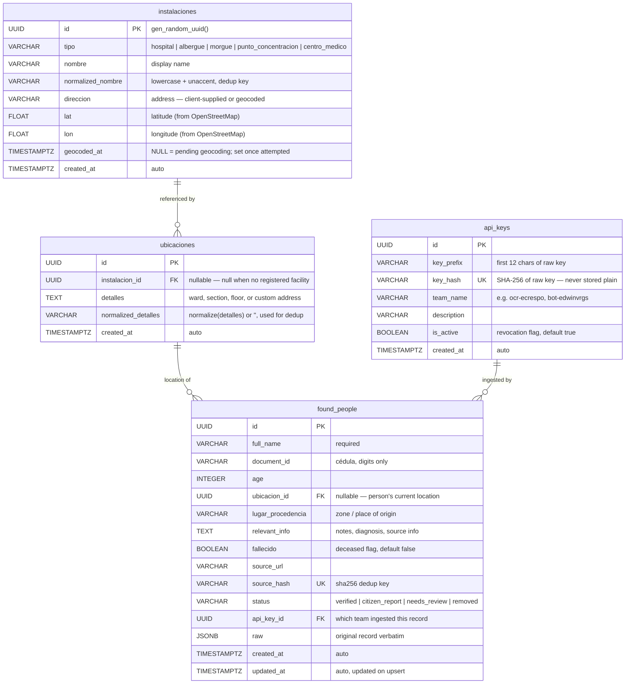

# Entity-Relationship Diagram



## Relationships

| From | Cardinality | To | Description |
|---|---|---|---|
| `instalaciones` | 1 → many | `ubicaciones` | A facility can have many location instances (one per ward/section/detail) |
| `ubicaciones` | 1 → many | `found_people` | A location can have many people (e.g. all patients in the same ward) |
| `api_keys` | 1 → many | `found_people` | A team API key is linked to all records it ingested |

## Location model explained

```
instalaciones           — the registered facility (Hospital Vargas, Albergue Catia, etc.)
    ↓ (optional FK)
ubicaciones             — a specific location within or without a facility
    · instalacion_id    → points to a known facility, OR null for unknown/ad-hoc locations
    · detalles          → "Sala de Emergencias, Piso 3" OR "Calle Principal #5, Catia"
    ↓
found_people.ubicacion_id
```

**Example flows:**
- Person at a registered hospital ward: `instalacion → Hospital Vargas` + `detalles = "UCI"`
- Person at a shelter: `instalacion → Albergue Municipal Catia` + `detalles = null`
- Person at an unknown address: `instalacion_id = null` + `detalles = "Casa amarilla, Av. Principal, La Guaira"`

## Valid `tipo` values for `instalaciones`

| Tipo | Description |
|---|---|
| `hospital` | Full hospitals |
| `albergue` | Shelters and temporary housing |
| `centro_medico` | Clinics and smaller medical centers |
| `morgue` | Morgues — for identification of deceased |
| `punto_concentracion` | Staging/assembly points set up after the earthquake |

## Notes

- `ubicacion_id` on `found_people` is nullable — a record can exist without a known location (e.g. unconfirmed citizen reports)
- `api_key_id` on `found_people` records which team submitted each row — useful for audit and data quality tracking
- `source_hash` is the **deduplication key**: bulk upserts use `ON CONFLICT (source_hash) DO UPDATE`
- `fallecido = true` does NOT set `status = 'removed'` — deceased records remain publicly searchable for family identification
- `status = 'removed'` is a soft delete for data quality reasons (duplicates, errors); it hides records from default search
- `ubicaciones` deduplicates by `(instalacion_id, normalized_detalles)` — same ward at the same hospital → same `ubicacion` row shared across all people there

## Indexes

| Table | Column(s) | Type | Purpose |
|---|---|---|---|
| `found_people` | `document_id` | B-tree | Exact cédula lookup |
| `found_people` | `status` | B-tree | Status filter |
| `found_people` | `updated_at DESC` | B-tree | Default sort |
| `found_people` | `ubicacion_id` | B-tree | Location filter join |
| `found_people` | `api_key_id` | B-tree | Per-team record queries |
| `found_people` | `fallecido` | B-tree | Deceased filter |
| `found_people` | `full_name` (GIN trgm) | GIN | Fuzzy name search via `pg_trgm` |
| `instalaciones` | `(tipo, normalized_nombre)` | Unique | Facility dedup per type |
| `instalaciones` | `created_at` WHERE `geocoded_at IS NULL` | Partial B-tree | Geocoding worker's pending-queue scan |
| `ubicaciones` | `(instalacion_id, normalized_detalles)` | Unique | Location dedup per facility+ward |

## Geocoding

`direccion`, `lat`, and `lon` on `instalaciones` are filled by a background worker (see the
[ETL diagram](etl-diagram.md)). `geocoded_at` is the queue marker: `NULL` means the facility
still needs an address; the worker claims those rows (`FOR UPDATE SKIP LOCKED`), calls
OpenStreetMap Nominatim, and stamps `geocoded_at`. A client-supplied `direccion` is stored on
ingestion and pre-marks the row done.
