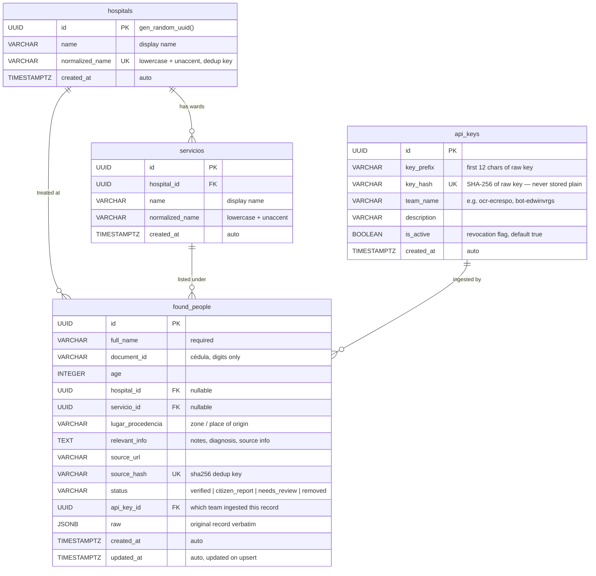

# Entity-Relationship Diagram

## Relationships

| From | Cardinality | To | Description |
|---|---|---|---|
| `hospitals` | 1 → many | `servicios` | A hospital has zero or more wards/sections |
| `hospitals` | 1 → many | `found_people` | A hospital has zero or more patient records |
| `servicios` | 1 → many | `found_people` | A ward/section has zero or more patient records |
| `api_keys` | 1 → many | `found_people` | A team API key is linked to all records it ingested |

## Notes

- `hospital_id` and `servicio_id` on `found_people` are **nullable** — a record can exist without a known hospital (e.g. citizen reports)
- `api_key_id` is nullable only for records created before multi-tenant keys were introduced
- `source_hash` is the **deduplication key**: bulk upserts use `ON CONFLICT (source_hash) DO UPDATE`, so re-ingesting the same source is always safe
- `hospitals.normalized_name` and `(servicios.hospital_id, servicios.normalized_name)` carry unique constraints — facility names are deduplicated with `unaccent` + lowercase normalization on every ingest
- `status = 'removed'` is a soft delete — records remain in the DB and are hidden from default search results but can be queried explicitly with `?status=removed`

## Indexes

| Table | Column(s) | Type | Purpose |
|---|---|---|---|
| `found_people` | `document_id` | B-tree | Exact cédula lookup |
| `found_people` | `status` | B-tree | Status filter |
| `found_people` | `updated_at DESC` | B-tree | Default sort |
| `found_people` | `hospital_id` | B-tree | Hospital filter join |
| `found_people` | `api_key_id` | B-tree | Per-team record queries |
| `found_people` | `full_name` (GIN trgm) | GIN | Fuzzy name search via `pg_trgm` |
| `hospitals` | `normalized_name` | Unique | Facility dedup |
| `servicios` | `(hospital_id, normalized_name)` | Unique | Ward dedup per hospital |
