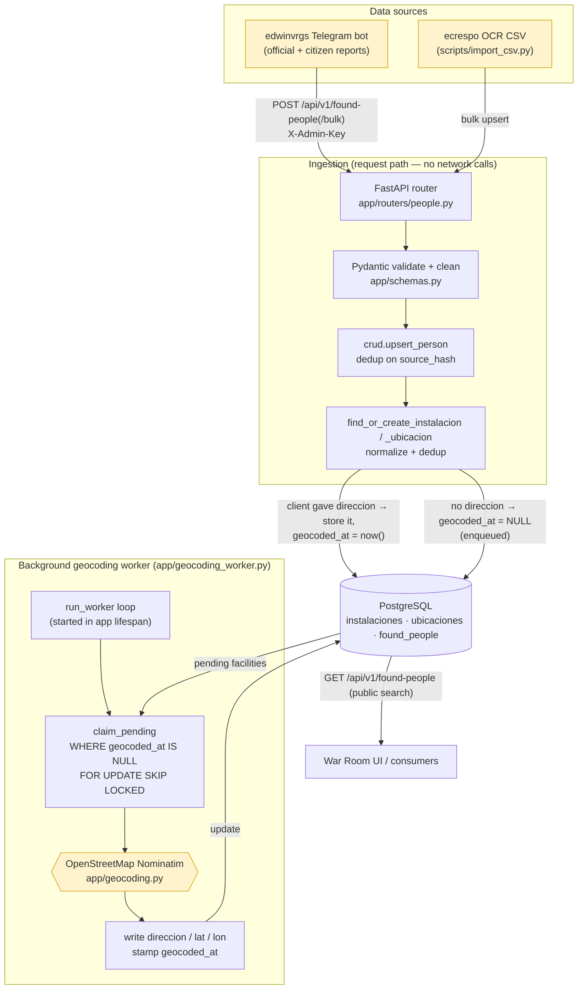

# ETL / Data-Flow Diagram

How records move from volunteer sources into the searchable registry, and how facility
addresses are filled asynchronously by the background geocoding worker.

## Outcome handling in the worker

For each claimed facility the worker calls Nominatim and acts on the outcome:

| Outcome | Condition | Action |
|---|---|---|
| **matched** | OSM returned a result | write `direccion`/`lat`/`lon`, stamp `geocoded_at` (done) |
| **no match** | HTTP 200, empty list | stamp `geocoded_at` only — stop retrying a dead end |
| **transient** | timeout / network / 5xx | leave `geocoded_at` NULL — retried next cycle |

## Key properties

- **Geocoding is off the request path.** Ingestion returns immediately; addresses fill in
  asynchronously. Bulk imports never block on (or get throttled by) Nominatim.
- **The queue is a column, not a broker.** `geocoded_at IS NULL` ⟺ "needs geocoding",
  backed by the partial index `ix_instalaciones_pending_geocode`. New rows enqueue
  automatically; client-supplied addresses are pre-marked done.
- **Safe to scale.** `FOR UPDATE SKIP LOCKED` lets multiple workers/replicas share the
  queue without double-processing. Concurrency defaults to 1 to respect public Nominatim's
  ~1 req/sec policy.
- **Manual drain.** `scripts/backfill_addresses.py` runs the same `process_pending_batch`
  on demand (e.g. without the web app, or when the worker is disabled).
